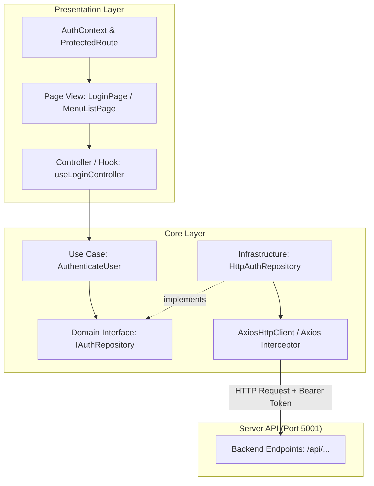

# Dokumentasi Arsitektur Frontend Framework v1

Aplikasi frontend ini dibangun menggunakan **React 18**, **TypeScript**, **Vite**, dan **Tailwind CSS** dengan menerapkan pola **Clean Architecture** (memisahkan domain bisnis, infrastruktur API, dan lapisan presentasi antarmuka).

---

## 📁 1. Struktur Direktori & Keterangan Folder

```text
frontend/
├── doc/                               # Dokumentasi teknis frontend & panduan developer
│   └── README.md                      # Dokumentasi komprehensif struktur & review arsitektur
├── public/                            # Asset statis publik (favicon, logo, dll)
├── src/
│   ├── core/                          # Lapisan Inti Bisnis (Core Layer)
│   │   ├── domain/                    # Entitas model & kontrak repositori
│   │   │   ├── models/                # Definisi tipe data bisnis (User.ts, Permission)
│   │   │   └── repositories/          # Interface kontrak komunikasi data (IAuthRepository.ts)
│   │   ├── infrastructure/            # Adapter alat luar & implementasi teknis
│   │   │   ├── api/                   # HTTP Client & Interceptor (AxiosHttpClient.ts)
│   │   │   └── repositories/          # Implementasi interface via HTTP (HttpAuthRepository.ts)
│   │   └── use-cases/                 # Orkestrasi alur kerja use-case (AuthenticateUser.ts)
│   │
│   ├── presentation/                  # Lapisan Antarmuka Pengguna (UI Layer)
│   │   ├── components/                # Komponen UI bersama (Reusable Components)
│   │   │   ├── AdminLayout.tsx        # Shell tata letak admin (Sidebar + Header + Content)
│   │   │   ├── Sidebar.tsx            # Komponen navigasi dinamis berbasis data database (Tree)
│   │   │   ├── Header.tsx             # Bilah atas (profil user, tombol logout, toggle sidebar)
│   │   │   ├── ProtectedRoute.tsx     # Guard rute berbasis token JWT & permission level ACL
│   │   │   ├── SlideOver.tsx          # Komponen drawer form slide-over dari sisi kanan layar
│   │   │   ├── Button.tsx             # Atom komponen tombol bersahabat
│   │   │   └── InputField.tsx         # Atom komponen form input teks
│   │   ├── context/                   # Global State Management berbasis React Context
│   │   │   └── AuthContext.tsx        # Penyedia status login, decode token, & verifikasi izin
│   │   ├── pages/                     # Halaman Tampilan (Screens/Views)
│   │   │   ├── Login/                 # Halaman Masuk (LoginPage & useLoginController)
│   │   │   ├── Dashboard/             # Halaman Beranda / Dashboard Ringkasan
│   │   │   ├── Unauthorized/          # Halaman fallback 403 Forbidden
│   │   │   └── Settings/              # Modul Pengaturan Sistem
│   │   │       ├── Menu/              # CRUD Master Menu (MenuListPage & MenuFormPage)
│   │   │       ├── Role/              # CRUD Master Role & ACL Matrix (RoleListPage & RoleFormPage)
│   │   │       └── RoleUser/          # Manajemen Pengguna & Alokasi Role (RoleUserPage)
│   │   ├── utils/                     # Fungsi utilitas helper (currency.ts, date.ts)
│   │   ├── theme/                     # Design System Tokens & Presets (designSystem.ts)
│   │   └── PageLoader.tsx             # Komponen fallback rute dinamis (Under Construction)
│   │
│   ├── App.tsx                        # Konfigurasi React Router & pemetaan rute aplikasi
│   ├── main.tsx                       # Entry point aplikasi React & mounting ke DOM
│   └── index.css                      # Styling global, variabel CSS & utilitas Tailwind
│
├── Dockerfile                         # Konfigurasi container Docker frontend
├── package.json                       # Dependensi proyek & npm scripts
├── tailwind.config.js                 # Konfigurasi tema Tailwind CSS & Design System
├── tsconfig.json                      # Konfigurasi TypeScript compiler
└── vite.config.ts                     # Konfigurasi bundler Vite & plugin React
```

---

## 🎨 2. Design System Framework v1

Aplikasi frontend menerapkan pondasi desain sistem standar yang konsisten di seluruh aplikasi:

### A. Brand Colors
| Token Name | Hex Code | Utility Class | Penggunaan |
| :--- | :--- | :--- | :--- |
| **Brand Purple Dark** | `#231043` | `bg-brand-purple`, `text-brand-purple` | Warna primer utama, hero promosi, sidebar gelap |
| **Brand Purple Vibrant** | `#6D28D9` | `bg-brand-purple-vibrant` | Aksen tombol aktif, highlight, fokus interaktif |
| **Brand Gold** | `#D3B973` | `bg-brand-gold`, `text-brand-gold` | Aksen lencana premium, bintang, garis pembatas emas |

### B. Semantic Colors
| Status | Warna Utama | Shade 50 (Background) | Utility Class |
| :--- | :--- | :--- | :--- |
| **Success** | `#10B981` | `#ECFDF5` | `bg-success`, `text-success`, `bg-semantic-success-50` |
| **Warning** | `#F59E0B` | `#FFFBEB` | `bg-warning`, `text-warning`, `bg-semantic-warning-50` |
| **Error** | `#EF4444` | `#FEF2F2` | `bg-error`, `text-error`, `bg-semantic-error-50` |
| **Info** | `#3B82F6` | `#EFF6FF` | `bg-info`, `text-info`, `bg-semantic-info-50` |

### C. Neutral Grayscale
- **Gray 950**: `#030712` (Kontras tinggi / teks pekat / latar hitam)
- **Gray 900**: `#111827` (Teks judul utama, tombol solid dark)
- **Gray 700**: `#374151` (Label form, subjudul)
- **Gray 600**: `#4B5563` (Teks paragraf)
- **Gray 500**: `#6B7280` (Teks sekunder / muted)
- **Gray 400**: `#9CA3AF` (Placeholder input, border halus)
- **Gray 300**: `#D1D5DB` (Border input standar)
- **Gray 200**: `#E5E7EB` (Garis pembatas tabel)
- **Gray 100**: `#F3F4F6` (Latar belakang halaman & card subtle)
- **Gray 50**:  `#F9FAFB` (Latar belakang tabel zebra & form field)

### D. Typography & Skala Grid
- **Font Family**: Google Fonts **`Inter`** (`font-sans` / `font-inter`)
- **Spacing Grid**: Skala **4px Grid** standar (`p-1`: 4px, `p-2`: 8px, `p-3`: 12px, `p-4`: 16px, `p-5`: 20px, `p-6`: 24px, `p-8`: 32px)
- **Border Radius**:
  - `4px`: `rounded-sm` / `rounded-4`
  - `6px`: `rounded` / `rounded-6`
  - `8px`: `rounded-md` / `rounded-8`
  - `12px`: `rounded-lg` / `rounded-12`
  - `16px`: `rounded-xl` / `rounded-16`
  - `24px`: `rounded-2xl` / `rounded-24`
  - `Full`: `rounded-full` (9999px)

---

## 🏗️ 3. Pola Arsitektur Frontend (Clean Architecture Flow)

Aplikasi ini memisahkan logika menjadi 2 area besar: **`core`** (logika bisnis dan integrasi data) dan **`presentation`** (komponen antarmuka pengguna).



---

## 🧩 3. Penjelasan Modul & Komponen Utama

### A. Komunikasi API & Token Interceptor (`AxiosHttpClient.ts`)
- **Lokasi**: [AxiosHttpClient.ts](file:///Users/dyra/Documents/Docker/framework-app/frontend/src/core/infrastructure/api/AxiosHttpClient.ts)
- Base URL otomatis membaca `import.meta.env.VITE_API_URL` (default: `http://localhost:5001`).
- Dilengkapi **Request Interceptor** yang secara otomatis membaca token dari `localStorage.getItem('token')` dan menyuntikkannya ke header:
  ```http
  Authorization: Bearer <token>
  ```
  Developer tidak perlu lagi menyisipkan token secara manual di setiap pemanggilan API.

---

### B. Otentikasi & Status Global (`AuthContext.tsx`)
- **Lokasi**: [AuthContext.tsx](file:///Users/dyra/Documents/Docker/framework-app/frontend/src/presentation/context/AuthContext.tsx)
- Menggunakan library `jwt-decode` untuk membaca payload token JWT:
  - `user`: Menyimpan `{ id, username, jenis }`.
  - `permissions`: Menyimpan array hak akses menu `[{ menuId: number, enable: boolean, level: number }]`.
- **Fitur Otomatis**:
  - Validasi kadaluwarsa token: Jika `exp < currentTime`, sesi otomatis di-logout.
  - Fungsi `hasPermission(menuId, minLevel)`: Mengecek apakah user berhak mengakses menu pada tingkat CRUD tertentu.
  - **Super Admin Bypass**: Akun dengan `username === 'admin'`, `jenis === 'SA'`, atau `jenis === 'admin'` otomatis memiliki akses penuh tanpa diblokir ACL.

---

### C. Navigasi Dinamis Sidebar (`Sidebar.tsx`)
- **Lokasi**: [Sidebar.tsx](file:///Users/dyra/Documents/Docker/framework-app/frontend/src/presentation/components/Sidebar.tsx)
- **Fitur Utama**:
  1. **Database-Driven**: Menu tidak ditulis statis (hardcoded), melainkan diambil langsung secara dinamis dari endpoint backend `GET /api/user/menus`.
  2. **Hierarki Rekursif (*Tree Structure*)**: Mampu merender struktur menu bertingkat (Root Header ➔ Submenu ➔ Child Submenu) secara otomatis.
  3. **Auto-Expand**: Jika user membuka rute halaman anak (contoh `/settings/role`), dropdown induk ("PENGATURAN") otomatis terbuka dan ditandai aktif.
  4. **Normalisasi Path**: Otomatis menambahkan garis miring `/` di depan link database untuk mencegah bug navigasi relatif React Router.
  5. **Leaf Menu Handling**: Menu tunggal yang tidak memiliki submenu (seperti Dashboard) langsung dapat diklik dan ditandai dengan indikator aktif yang presisi.

---

### D. Penjaga Rute Otorisasi (`ProtectedRoute.tsx`)
- **Lokasi**: [ProtectedRoute.tsx](file:///Users/dyra/Documents/Docker/framework-app/frontend/src/presentation/components/ProtectedRoute.tsx)
- Membungkus halaman yang memerlukan login dan otorisasi menu spesifik:
  ```tsx
  <ProtectedRoute menuId={3} minLevel={1}>
    <RoleListPage />
  </ProtectedRoute>
  ```
  - Jika belum login ➔ dialihkan ke `/login`.
  - Jika tidak memiliki hak akses (ACL) ➔ dialihkan ke `/unauthorized`.
  - Super Admin otomatis lolos verifikasi.

---

### E. Penanganan Rute Belum Terdaftar (`PageLoader.tsx`)
- **Lokasi**: [PageLoader.tsx](file:///Users/dyra/Documents/Docker/framework-app/frontend/src/presentation/PageLoader.tsx)
- Bertindak sebagai rute penangkap (*catch-all route `/*`*).
- Jika ada menu baru di database yang tautannya belum memiliki komponen halaman aktif (contoh: `settings/test2`), sistem tidak akan melempar error atau mental ke dashboard, melainkan menampilkan tampilan ramah: **"Halaman Sedang Dalam Pengembangan"** beserta tombol kembali.

---

### F. Panel Drawer Form Meluncur (`SlideOver.tsx`)
- **Lokasi**: [SlideOver.tsx](file:///Users/dyra/Documents/Docker/framework-app/frontend/src/presentation/components/SlideOver.tsx)
- Menyediakan interaksi modern di mana form input (Tambah/Edit) meluncur keluar (*slide-over drawer*) dari sisi kanan layar:
  - **Sisi Kiri**: Tetap menampilkan Sidebar navigasi.
  - **Sisi Tengah**: Menampilkan tabel data utama dengan latar belakang redup (*dim backdrop overlay*).
  - **Sisi Kanan**: Panel form slide-over dengan scroll vertikal independen, header judul & tombol tutup (X), body input data responsif, dan sticky footer tombol aksi ("Batal" & "Simpan").
- Diterapkan pada seluruh halaman pengaturan: **`Settings/RoleUser`**, **`Settings/Menu`**, dan **`Settings/Role`**.

---

## 📊 4. Laporan Review & Audit Arsitektur Frontend

| Aspek Evaluasi | Skor | Status | Analisis & Temuan |
| :--- | :---: | :---: | :--- |
| **Arsitektur & Modularitas** | **8.5 / 10** | 🟢 Sangat Baik | Struktur Clean Architecture (`core` vs `presentation`) sangat rapi dan jarang ditemui di frontend standar. |
| **Integrasi Navigasi & ACL** | **9.0 / 10** | 🟢 Luar Biasa | Integrasi Sidebar dinamis dengan ACL token JWT berjalan mulus dan responsif. |
| **Konsistensi Pola Data** | **6.5 / 10** | 🟡 Perlu Perbaikan | Modul Auth sudah menggunakan pola Use Case + Controller Hook, namun modul Menu dan Role masih langsung memanggil `AxiosHttpClient` di dalam file komponen Page. |
| **State Management** | **7.0 / 10** | 🟡 Cukup | Mengandalkan `useState` & `useEffect` lokal di tiap halaman. Belum ada cache server-state (misal: TanStack Query). |
| **Type Safety & TypeScript** | **7.5 / 10** | 🟡 Baik | Sudah berbasis TypeScript kuat, namun masih ada tipe `any` pada penanganan error dan parsing data tabel. |
| **SKOR KESELURUHAN** | **7.7 / 10** | 🟢 **BAIK & SIAP PRODUKSI DENGAN REKOMENDASI** | |

### Temuan Utama & Rekomendasi Peningkatan:

1. **Standarisasi Pemanggilan API (Data Layer)**:
   - *Temuan*: Pada [MenuListPage.tsx](file:///Users/dyra/Documents/Docker/framework-app/frontend/src/presentation/pages/Settings/Menu/MenuListPage.tsx) dan [RoleListPage.tsx](file:///Users/dyra/Documents/Docker/framework-app/frontend/src/presentation/pages/Settings/Role/RoleListPage.tsx), pemanggilan API dilakukan langsung:
     ```typescript
     AxiosHttpClient.get('/api/menus').then(...)
     ```
   - *Rekomendasi*: Selaraskan dengan pola modul Auth dengan membuat service/repository tersendiri di `core/infrastructure/repositories/HttpMenuRepository.ts` agar halaman UI benar-benar bersih dari URL endpoint.

2. **Modul RoleUser (Selesai)**:
   - *Status*: Telah diimplementasikan secara komprehensif di [RoleUserPage.tsx](file:///Users/dyra/Documents/Docker/framework-app/frontend/src/presentation/pages/Settings/RoleUser/RoleUserPage.tsx) dan terhubung ke route `/settings/roleuser`.
   - *Fitur*: Tabel daftar pengguna dengan badge status & role grup, form penambahan pengguna baru, edit pengguna, modal alokasi role per user secara interaktif, pencarian multi-parameter, serta proteksi penghapusan akun admin utama.

3. **Adopsi Server-State Management (Opsional untuk Skala Besar)**:
   - *Rekomendasi*: Untuk pengembangan jangka panjang dengan data transaksi yang padat, pertimbangkan mengadopsi **TanStack Query (React Query)** agar fetching data memiliki automatic caching, deduplikasi request, dan mutasi optimistik.

---

## 🚀 5. Panduan Menambah Halaman Baru (Developer Guide)

Untuk menambahkan halaman atau modul baru di frontend:

1. **Buat Komponen Halaman**:
   Buat file di `src/presentation/pages/<NamaModul>/<NamaHalaman>Page.tsx`:
   ```tsx
   import React from 'react';
   import { AdminLayout } from '../../components/AdminLayout';

   export const MyNewPage: React.FC = () => {
     return (
       <AdminLayout>
         <h1 className="text-2xl font-bold text-slate-800">Judul Halaman</h1>
         {/* Konten Halaman */}
       </AdminLayout>
     );
   };
   ```

2. **Daftarkan Rute di [App.tsx](file:///Users/dyra/Documents/Docker/framework-app/frontend/src/App.tsx)**:
   ```tsx
   import { MyNewPage } from './presentation/pages/MyModul/MyNewPage';

   // Di dalam <Routes>:
   <Route
     path="/my-path"
     element={
       <ProtectedRoute menuId={ID_MENU_DI_DB} minLevel={1}>
         <MyNewPage />
       </ProtectedRoute>
     }
   />
   ```

3. **Pastikan Rute Terdaftar di Database Backend**:
   - Daftarkan menu di tabel `menu` dengan kolom `link` diisi `my-path`.
   - Berikan hak akses pada tabel `login_grp_acl` untuk role yang bersangkutan.
   - Menu akan otomatis muncul di Sidebar frontend tanpa perlu mengubah kode `Sidebar.tsx`.
